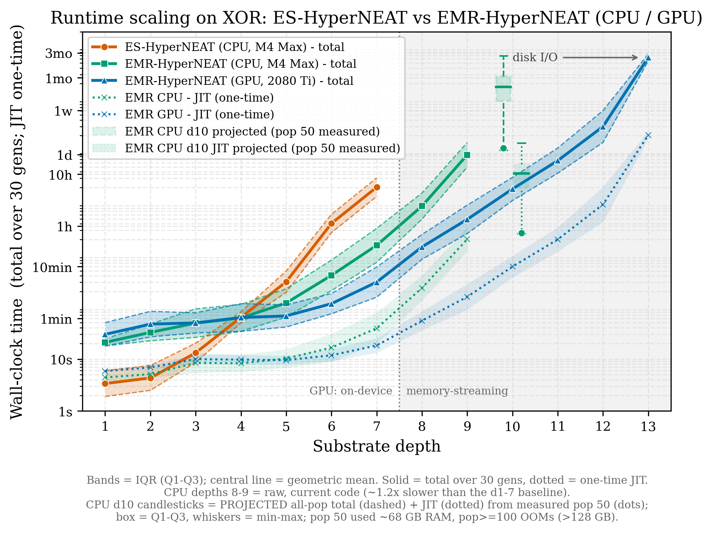
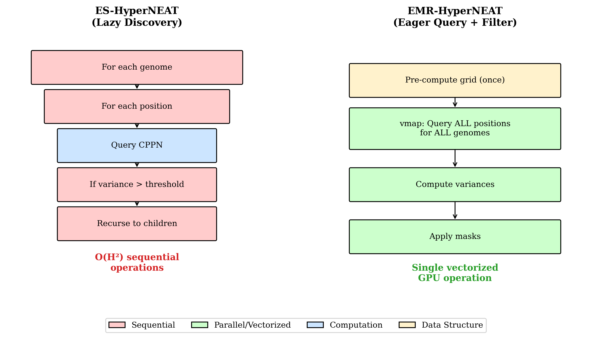
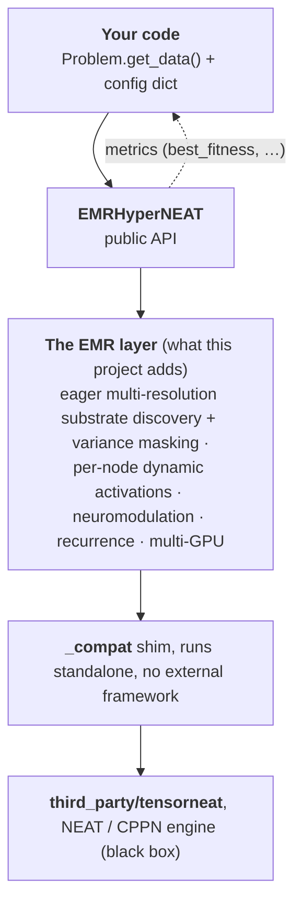

# EMR-HyperNEAT

**Eager Multi-Resolution HyperNEAT**, a GPU-accelerated reformulation of
ES-HyperNEAT for adaptive-substrate neuroevolution.

ES-HyperNEAT discovers where to place neurons by recursively subdividing space with
a **sequential quadtree** driven by CPPN-output variance. That quadtree is inherently
serial and CPU-bound, which caps the method at small substrates. EMR-HyperNEAT
replaces it with **eager tensor evaluation on a pre-computed hierarchical grid** plus
**post-hoc variance masking**: substrate discovery becomes batch matrix arithmetic
that `vmap`s across an entire population on the GPU, orders of magnitude faster at
scale while producing equivalent substrates.

<p align="center">
  
</p>
<p align="center"><em>Wall-clock time to evolve XOR as substrate depth grows. ES-HyperNEAT's sequential quadtree (orange, CPU) becomes intractable past depth 7, while EMR-HyperNEAT's vectorized discovery keeps scaling: on CPU (green) through depth 9 and on GPU (blue) out to depth 13. Bands show the IQR over 30 generations. From the GECCO 2026 paper.</em></p>

This repository packages the EMR-HyperNEAT algorithm as a standalone, installable
library together with the code to reproduce the experiments from its papers.

## Key Features

EMR-HyperNEAT evolves indirectly-encoded neural substrates with tensor acceleration, and extends the
substrate itself with evolvable, per-node computation:

- **Tensor-accelerated substrate evolution.** Evolves neural-network substrates through indirect
  encoding (CPPNs, as in HyperNEAT), with substrate discovery expressed as batched tensor operations
  that `vmap` across a whole population and scale on GPU.
- **Tensor substrate representation.** The substrate is a pre-computed multi-resolution grid evaluated
  eagerly as tensors, then filtered by variance to a sparse active set, replacing ES-HyperNEAT's
  sequential, CPU-bound quadtree.
- **Multi-GPU, chunked execution.** Substrate evaluation distributes across multiple GPUs, and the
  substrate's position computation (whose size grows with depth) runs in memory-bounded chunks, so
  evolution scales to deep substrates that would otherwise exhaust device memory.
- **Per-node activation functions.** Each node's activation is evolved from an 18-function palette
  instead of a single fixed nonlinearity.
- **Per-node aggregation functions.** How a node combines its inputs (sum, mean, min, max, and others)
  is also evolvable. *Partial: currently exercised through the bio-inspired palette path.*
- **Neuromodulation.** Neurotransmitter vectors `[DA, 5HT, NE, ACh]` modulate per-node behavior, so a
  single evolved substrate can solve several tasks.
- **Bio-inspired meta-learning.** A library of biologically inspired strategies meta-evolves which
  activation and aggregation functions the substrate has available over generations.
- **Hidden-to-hidden recurrence.** Optional recurrent connections with caching, for tasks that need
  memory.

## Documentation

Full guides live in [`docs/`](docs/README.md):

| Guide | For |
|---|---|
| [Installation](docs/installation.md) | Cloning with the submodule, the pinned JAX stack, CPU/GPU. |
| [Architecture](docs/architecture.md) | The component diagram, what EMR adds on top of TensorNEAT, the module map. |
| [Writing experiments](docs/writing-experiments.md) | The public API, the `Problem` interface, a complete runnable example. |
| [Configuration reference](docs/configuration.md) | Every knob: the substrate and the four feature dimensions. |
| [Testing](docs/testing.md) | The test suite, markers, and validating CI locally with `act`. |
| [Reproducing experiments](docs/reproducing-experiments.md) | Fetching the data release and regenerating each paper's results. |

## Status

> **Research code, not production software.** This repository is the code accompanying the
> EMR-HyperNEAT papers. It is tested for reproducing their published results and for showing
> what the EMR-HyperNEAT concept enables; other uses are untested.

## How it fits together

EMR-HyperNEAT keeps ES-HyperNEAT's CPPN-based encoding but swaps its sequential quadtree for an
eager, vectorized substrate-discovery pipeline:

<p align="center">
  
</p>
<p align="center"><em>ES-HyperNEAT discovers nodes lazily, one genome and one position at a time (a quadratic number of sequential CPPN queries). EMR-HyperNEAT pre-computes the candidate grid once, queries every position for every genome in one vectorized pass, then filters by variance, which is what makes substrate discovery GPU-parallel. From the GECCO 2026 paper.</em></p>

The library wraps that pipeline behind one public class, layered on top of TensorNEAT:



See [Architecture](docs/architecture.md) for the full diagram, the module map, and the
TensorNEAT integration seam.

## Installation

```bash
git clone --recursive https://github.com/RomainClaret/emr-hyperneat.git
cd emr-hyperneat
pip install -e . -c requirements-lock.txt                      # the emr_hyperneat package
pip install -e third_party/tensorneat -c requirements-lock.txt # the pinned TensorNEAT fork
export JAX_PLATFORMS=cpu                                        # CPU is sufficient for everything here
```

Requires Python ≥ 3.10. The `-c requirements-lock.txt` constraint pins the exact stack the published
results were produced on (JAX 0.6.1); omit it to run on the latest JAX (the code works, and the
bit-exact golden tests auto-skip off that stack). Full instructions, GPU setup, and troubleshooting:
[docs/installation.md](docs/installation.md).

## Quick start

Evolve a network to solve XOR with a per-node `sin` activation (solves on the first generation):

```python
from emr_hyperneat import EMRHyperNEAT

class XorProblem:                       # a problem is a plain duck-typed object
    input_shape  = (3,)                 # 2 inputs + 1 bias
    output_shape = (1,)
    jitable = True
    use_bias = True
    fitness_threshold = 0.95
    def get_data(self):                 # list of (input, target) pairs
        return [([0., 0., 1.], [0.]), ([0., 1., 1.], [1.]),
                ([1., 0., 1.], [1.]), ([1., 1., 1.], [0.])]

problem = XorProblem()
n_in = problem.input_shape[0]
config = {"algorithm_params": {"emrhyperneat": {
    "population_size": 150,
    # one (x, y) coordinate per input node and per output node:
    "substrate": {"input_coords": [(-1.0 + 2.0 * i / (n_in - 1), -1.0) for i in range(n_in)],
                  "output_coords": [(0.0, 1.0)]},
    "emr_hyperneat": {"initial_depth": 0, "max_depth": 2, "variance_threshold": 0.03,
                      "dynamic_functions": {"mode": "global", "hidden_activation": "sin"}},
}}}

algo  = EMRHyperNEAT()
cfg   = algo.create_config(config)
state = algo.initialize(cfg, problem, seed=0)
for gen in range(20):
    state, metrics = algo.run_generation(state, problem, verbose=False)
    if metrics.best_fitness >= problem.fitness_threshold:
        print(f"solved at gen {gen}: {metrics.best_fitness:.6f}")
        break
```

> The first generation JIT-compiles, so expect a few-seconds pause and an `initializing` print on the
> first run, which is normal, not a hang. Runs are deterministic given the seed.

Defining your own problem, the full API, and every config option:
[docs/writing-experiments.md](docs/writing-experiments.md).

## Testing

```bash
pip install -e ".[dev]"                                     # pytest (in the dev extra)
JAX_PLATFORMS=cpu pytest emr_hyperneat/tests -m "not slow"   # fast suite (CI gate)
JAX_PLATFORMS=cpu pytest emr_hyperneat/tests                 # full suite incl. slow
```

The suite (900+ tests) covers every published feature plus isolation, determinism, and
EMR-vs-frozen-HMR equivalence guards, and includes paper-validation tests that re-run each paper's
simplest experiment. Details and `act` (local CI) instructions: [docs/testing.md](docs/testing.md).

## The papers

Each subdirectory of [`papers/`](papers/) is self-contained (its own runners, analysis, figures, and
a README with exact reproduction commands). Each paper adds a capability to the same algorithm core.

| Paper | Venue | Adds | Publication |
|-------|-------|------|-------------|
| [`emr-hyperneat`](papers/emr-hyperneat/README.md) | GECCO 2026 | the base EMR algorithm + GPU speedups | [10.1145/3795101.3805361](https://doi.org/10.1145/3795101.3805361) |
| [`emr-dynamic-functions`](papers/emr-dynamic-functions/README.md) | ALIFE 2026 | per-node activation function evolution | _DOI: to appear_ |
| [`emr-dynamic-functions-bio-inspired`](papers/emr-dynamic-functions-bio-inspired/README.md) | PPSN 2026 | bio-inspired palette-evolution strategies | _DOI: to appear_ |
| [`emr-neuromodulation`](papers/emr-neuromodulation/README.md) | ALIFE 2026 | neuromodulation for multi-task learning | _DOI: to appear_ |

The repository ships **code only**; result data is a separate Zenodo release fetched with
`python scripts/fetch_results.py`. How to reproduce each paper, and which experiments run on the
current EMR class vs the frozen HMR module: [docs/reproducing-experiments.md](docs/reproducing-experiments.md).

Data archive (all papers' result JSON), on Zenodo: [](https://doi.org/10.5281/zenodo.21383893)

Some experiments run on the **frozen HMR module** that produced the pre-migration published
results, vendored under [`emr_hyperneat/_hmr_frozen/`](emr_hyperneat/_hmr_frozen). It is bit-for-bit
equivalent to EMR on the shared paths (verified, 18/18 cells) and is not part of the public API.

## Repository layout

```
emr_hyperneat/        installable algorithm package (public API: EMRHyperNEAT)
  _compat/            vendored compatibility shim (internal; lets EMR run standalone)
  _hmr_frozen/        frozen HMR module (reproduction only)
  tests/              test suite incl. paper-validation
docs/                 documentation (start at docs/README.md)
third_party/tensorneat  pinned TensorNEAT fork (git submodule)
papers/               one self-contained directory per paper
scripts/              utilities (e.g. fetch_results.py)
```

## Community & Support

Questions, ideas, and experiences are all welcome. Start a thread in
[GitHub Discussions](https://github.com/RomainClaret/emr-hyperneat/discussions) to ask for help,
discuss the algorithm and its results, or share what you built or found, and let others learn from it.
For concrete bugs or problems, open a [GitHub issue](https://github.com/RomainClaret/emr-hyperneat/issues).

## License

Copyright (C) 2026 Romain Claret

This program is free software: you can redistribute it and/or modify it under the terms
of the GNU General Public License as published by the Free Software Foundation, either
version 3 of the License, or (at your option) any later version. See [LICENSE](LICENSE).

This program is distributed in the hope that it will be useful, but WITHOUT ANY WARRANTY;
without even the implied warranty of MERCHANTABILITY or FITNESS FOR A PARTICULAR PURPOSE.
See the GNU General Public License for more details.

## Acknowledgements

EMR-HyperNEAT builds directly on prior work:

- **ES-HyperNEAT** ([Risi and Stanley, 2012](https://doi.org/10.1162/artl_a_00071)), the evolvable-substrate method that EMR-HyperNEAT reformulates.
- **TensorNEAT** ([Wang et al., 2025](https://doi.org/10.1145/3730406)), the GPU-accelerated NEAT/CPPN library this project builds on and vendors as a submodule.
- **PUREPLES** ([Westh et al., 2017](https://github.com/ukuleleplayer/pureples)), whose ES-HyperNEAT implementation inspired parts of this one.

## Citation

The first entry below is **EMR-HyperNEAT itself**, the paper that introduces the
algorithm. If you use this repository, please cite it. The entries after it are the
papers that **extend EMR-HyperNEAT** with additional capabilities (per-node activation
functions, bio-inspired palette meta-learning, …); if you use one of those features,
please also cite the corresponding paper.

**The EMR-HyperNEAT algorithm:**

```bibtex
@inproceedings{claret2026emr,
  title={Tensor-Accelerated Eager Multi-Resolution Grids for Evolving Large-Scale Substrates},
  author={Claret, Romain and O'Neill, Michael and Cotofrei, Paul and Stoffel, Kilian},
  booktitle={Proceedings of the Genetic and Evolutionary Computation Conference Companion (GECCO Companion '26)},
  year={2026},
  address={San Jose, Costa Rica},
  publisher={ACM},
  doi={10.1145/3795101.3805361}
}
```

**Papers extending EMR-HyperNEAT:**

```bibtex
@inproceedings{claret2026activations,
  title={Per-Node Activation Function Evolution in Indirectly Encoded Substrates: Solvability, Limits, and Emergent Diversity},
  author={Claret, Romain and O'Neill, Michael and Cotofrei, Paul and Stoffel, Kilian},
  booktitle={Artificial Life Conference Proceedings 38},
  year={2026},
  publisher={MIT Press},
}

@inproceedings{claret2026bio,
  title={Bio-Inspired Palette Evolution in Indirectly Encoded Substrates: Timescale Compatibility Shapes Activation Function Discovery},
  author={Claret, Romain and O'Neill, Michael and Cotofrei, Paul and Stoffel, Kilian},
  booktitle={International Conference on Parallel Problem Solving from Nature},
  year={2026},
  organization={Springer}
}

@inproceedings{claret2026neuromodulation,
  title={Multi-Behavioral Evolved Substrates Through Neuromodulation and Activation Selection},
  author={Claret, Romain and O'Neill, Michael and Cotofrei, Paul and Stoffel, Kilian},
  booktitle={Artificial Life Conference Proceedings 38},
  year={2026},
  publisher={MIT Press},
}
```
