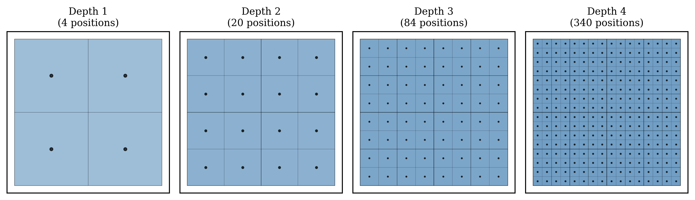
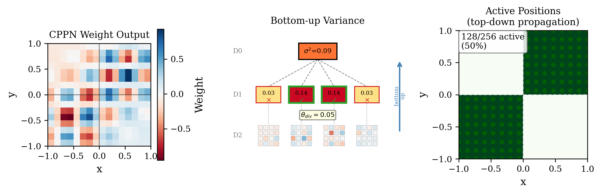
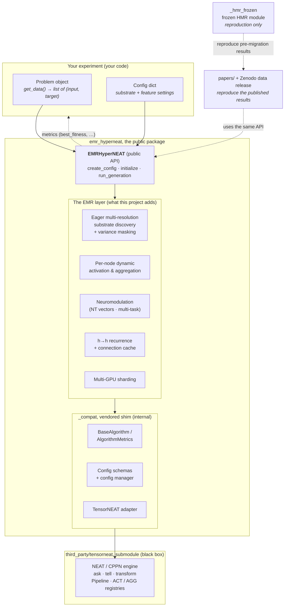

# Architecture

EMR-HyperNEAT is a **layer on top of TensorNEAT**, not a fork of it. TensorNEAT provides the
NEAT/CPPN engine (evolving a genotype network and querying it); EMR-HyperNEAT adds everything needed
to turn that engine into a fast adaptive-substrate neuroevolution system. This page explains the
layer the project adds and how the modules fit together. TensorNEAT internals are treated as a black
box that you never call directly.

## What EMR-HyperNEAT adds

ES-HyperNEAT decides *where to place neurons* by recursively subdividing space with a sequential
quadtree driven by CPPN-output variance. That quadtree is serial and CPU-bound, which caps the
method at small substrates. EMR-HyperNEAT replaces it with:

- **Eager multi-resolution substrate discovery**: a pre-computed hierarchical grid (4^(level+1)
  candidate positions per level) is evaluated all at once as batched tensor arithmetic that `vmap`s
  across the whole population, instead of one quadtree per genome.
- **Post-hoc variance masking**: after the eager evaluation, a variance threshold keeps only the
  informative positions, producing a sparse active substrate equivalent to what the quadtree would
  have found.

  

<em>The eager grid. Candidate positions densify with depth (4, 20, 84, 340 positions at depths 1 to 4). Every position is evaluated in one batched pass, rather than being reached by sequential subdivision.</em>

  

<em>Variance masking recovers the sparse substrate. The CPPN weight field (left) is reduced to per-region variance (center), and regions above threshold stay active (right), reproducing what the quadtree would have kept.</em>

On top of that substrate engine, the same package adds four evolvable *feature dimensions*:

- **Per-node dynamic activation functions**: each node can use a different activation, selected
  from an 18-function palette (see [configuration](configuration.md)). This is the single biggest
  lever for parity-style problems.
- **Per-node aggregation functions**: how a node combines its inputs (sum/mean/min/max/…). *Partial:
  exercised via the bio-inspired palette path (see [configuration](configuration.md)).*
- **Neuromodulation**: neurotransmitter vectors `[DA, 5HT, NE, ACh]` modulate node behavior, which
  enables one substrate to solve several tasks (multi-task).
- **Hidden-to-hidden recurrence** with a connection cache, for tasks that need memory.

Plus engineering for scale: a JIT cache, an h→h connection cache, and optional multi-GPU sharding.

## Component diagram

Data flows down (your problem + config → the API → the EMR layer → the shim → TensorNEAT); fitness
metrics flow back up to your loop. `_hmr_frozen` and the data release sit to the side. You only
touch them when reproducing older results.

## Module map

Everything is under `emr_hyperneat/`.

### Public: what you import and call

| Module | Role |
|---|---|
| `__init__.py` | The public surface. Exports exactly one name: `EMRHyperNEAT`. |
| `emrhyperneat.py` | The `EMRHyperNEAT` class and the feature layer: per-node dynamic activation/aggregation, neuromodulation, multi-task, the h→h cache, and the config dataclasses. Also defines `ACTIVATION_LIST` (the 18 activations) and `PALETTE_CONFIGS`. |
| `emrhyperneat_base.py` | The engine beneath the class: eager multi-resolution substrate discovery, recurrence/cache config, multi-GPU sharding, and the **TensorNEAT integration seam**. |
| `fitness_utils.py` | Ready-made fitness functions (binary / multi-class / regression) for benchmarks. |
| `multi_gpu_worker.py` | Worker processes for true multi-GPU runs (each owns its JAX runtime). Not needed for single-device use. |

You only ever construct `EMRHyperNEAT()` and call its methods (see
[Writing experiments](writing-experiments.md)).

### Internal: you do not import these directly

| Module | Role |
|---|---|
| `_compat/` | A small vendored **compatibility shim** so EMR-HyperNEAT runs standalone, without the author's larger `geenns` research framework. It provides `BaseAlgorithm` + `AlgorithmMetrics` (the base class and the metrics object), the Pydantic config schemas, the **TensorNEAT adapter**, and the config/parameter manager. It exists purely to keep the algorithm self-contained. |
| `_hmr_frozen/` | A **frozen copy** of the earlier HMR-HyperNEAT module (the original eager-multi-resolution implementation). It is bit-for-bit equivalent to EMR on the shared paths and reproduces specific pre-migration published results. It is not part of the public API. |
| `tests/` | The test suite (see [Testing](testing.md)), including `test_paper_validation.py`, which re-runs the simple paper experiments. |

## The TensorNEAT seam (the black box)

EMR-HyperNEAT reaches TensorNEAT through exactly two narrow seams, both inside the package internals:

1. The `_compat` **adapter** (`_compat/adapters/tensorneat_adapter.py`) builds the NEAT algorithm and
   its config and pulls TensorNEAT's activation/aggregation registries.
2. The **engine** (`emrhyperneat_base.py`) lazily imports TensorNEAT's HyperNEAT genome pieces, the
   `RecurrentGenome` (whose `forward` is the CPPN query), and the `Pipeline` driver, then JIT-compiles
   the ask/transform/tell evolutionary loop.

Everything the project adds (the eager grid, variance masking, batched CPPN queries across the
population, dynamic per-node functions, neuromodulation, and the caches) lives above this seam. You
do not need to understand NEAT or CPPNs to use EMR-HyperNEAT; you configure the substrate and the
feature dimensions, and the engine does the rest.

Next: [Writing experiments](writing-experiments.md) to use the API, or the
[configuration reference](configuration.md) for every knob.
